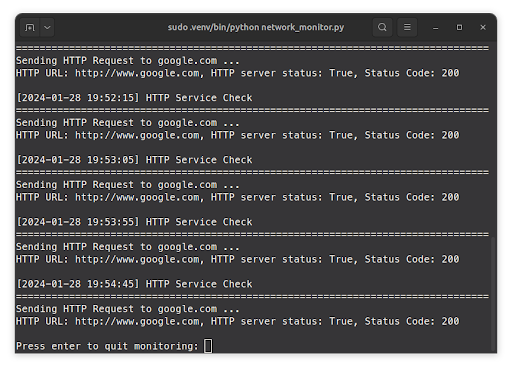
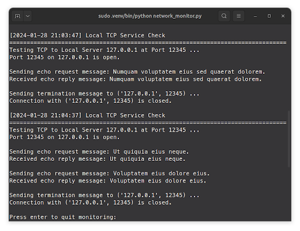

# NetCam

A network monitoring tool for monitoring the status of user-entered servers. The application handles the service checks automatically, monitoring ICMP, HTTP, HTTPS, NTP, DNS, TCP, and UDP on user-defined intervals.

## Setup

First, clone the repository or download/extract the files. Then, it is recommended to go to the project directory and create a virtual environment as follows: 

'''
python<version> -m venv <name-for-venv>
'''

Then, we need to activate the venv by running:

'''
source <name-for-venv>/bin/activate
'''

Now that the virtual environment is enabled in the terminal, we need to install the packages required by the program that reside in requirements.txt. To do so, we can run the following command:

'''
pip install -r requirements.txt
'''

Finally, to run the program, we can enter one of the following:

'''
sudo python network_monitor.py
'''
'''
sudo python3 network_monitor.py
'''
'''
sudo <name-for-venv>/bin/python network_monitor.py
'''

## Usage

On the home screen, enter any of the following commands (notice there is tab auto-completion and verification for commands). 

### Add Server

1. Enter command add-server on home screen
2. Enter domain or IP address for server you would like to add
3. Enter one of the available network protocols for testing the server with
4. Follow the on-screen prompts to enter desired parameters for the protocol and a test interval that determines how often the service check is run during automatic monitoring.
5. Repeat (input y) to add more services to the server if desired.

### Edit Server

1. Enter command edit-server on home screen
2. Enter command to add-service, edit-service, or delete-service.
   - Use add-service to add a new service to the server akin to how they were added in initial server setup.
   - Use edit-service to select an existing service and update params, again similar to how they were added in initial server setup.
   - Use delete-service to select an existing service and delete it from the server.

### Delete Server

1. Enter command delete-server on home screen
2. Select the server you would like to delete to remove it from the stored server list

### Show Servers

1. Enter command show-servers on home screen
2. List of servers and the services currently registered to them for monitoring will be displayed

### Monitor Server

1. Enter command monitor-server on home screen
2. Select the server you wish to monitor
3. The server will run service checks for the services currently registered to it automatically on the interval you defined during setup
4. Press enter after one cycle of tests to exit monitoring

### Monitor All Servers

1. Enter command monitor-all on home screen
2. All servers will run their configured service checks automatically on the intervals you defined for them during setup. Thread locking was implemented, so print overlap should not occur.
3. Press enter after one cycle of tests to exit monitoring

### Local TCP Echo Testing

The program is also packaged with an echo server and echo client that can be used independently or with the program.

#### Echo Client to Echo Server

The echo client and echo server may be started up in their own processes and tested interactively.
- The echo client will send an echo request message and display the message sent and (hopefully, if successful) the message received back from the echo server. 
- Multiple messages can be echoed in the same TCP connection if you wish, just send the message "Goodbye" to close the connection.

##### Echo Client Side

##### Echo Server Side

#### Application to Echo Server

The echo server may be added via the add-server command and set to utilize the local TCP service.
- Use IP address 127.0.0.1 and port 12345 during setup.
- The program will automatically generate a lorem ipsum sentence and send that to the echo server to echo back. 
- Status information and the message being sent and received will be displayed.
- The service-check will run automatically on the interval you defined during server setup.

##### Application Side

##### Echo Server Side

## Working On

- Converting to a Python class system rather than using dictionaries and JSON. This will hopefully make things more modular, testable, and succinct.
- Improving user interface flow. There are times when a user may decide they don't actually want to enter a new service or something of that nature, but the only way to back out is via CTRL + C.
- Cleaning up the logic of main and the project as a whole with more refactoring.
- Logic for setting optional parameters could use some clean-up.
- Adding more information to the list of services. All the details can be seen in the JSON file, service_checks.py, but more parameter details in the UI would likely be useful to the user.
    - Note: if the JSON file is cleared, make sure to start it with an empty dictionary for now. If not, an error will occur.
- Adding some color to the program with rich or similar library.
- Fix bug where user can add a new service in the edit-service page.
- Adding new monitoring features as the quarter progresses ... 

